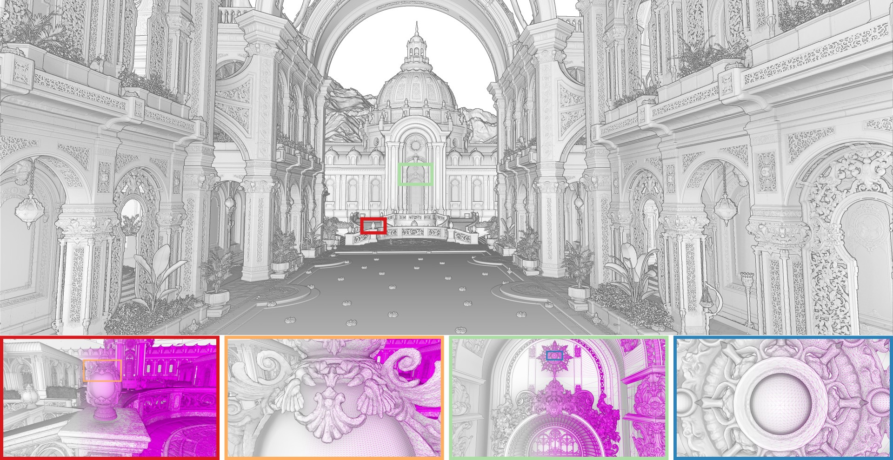
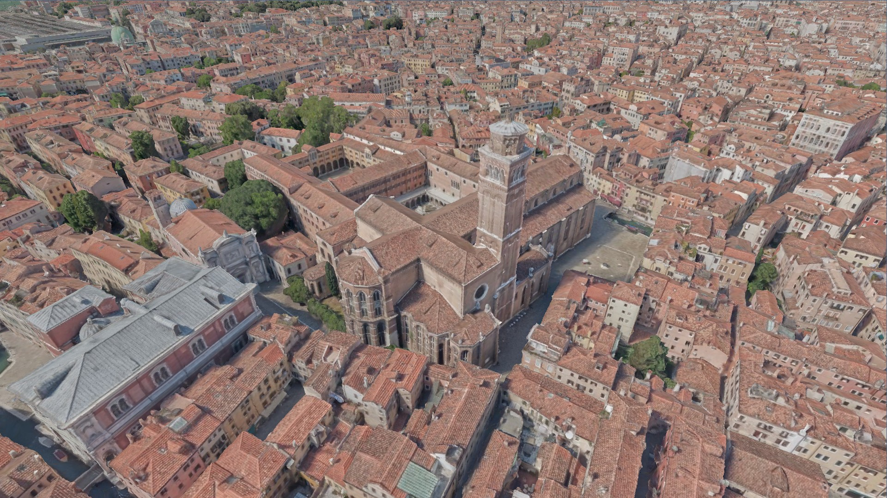
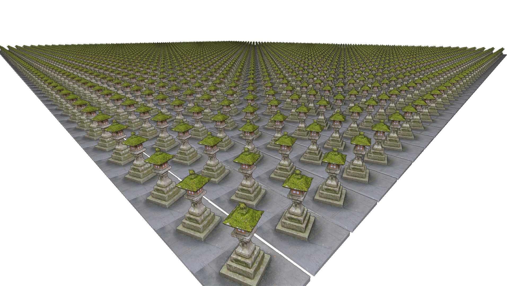

# CuRast: Cuda-Based Software Rasterization for Billions of Triangles

[\[Paper\]](./docs/CuRast_arxiv.pdf)

__About__: [Nanite](https://advances.realtimerendering.com/s2021/Karis_Nanite_SIGGRAPH_Advances_2021_final.pdf) has demonstrated that small triangles can be rasterized more efficiently with custom compute shaders than with the fixed-function hardware pipeline. Building on this insight, we explore how far this advantage can be pushed for real-time rendering of massive triangle datasets without relying on precomputed LODs or acceleration structures. 

__Method__: A 3-stage rasterization pipeline first rasterizes small triangles efficiently in stage 1, and falls back to other stages for increasingly larger triangles. Stage 1 assumes triangles are small and uses 1 thread to render them directly. If they are not, they are instead queued for stage 2 which uses 1 warp to render larger triangles with more compute power. If they are still too large, they are split up and queued for stage 3. 

__Results__: With CUDA, we can render large models with hundreds of millions of unique triangles 2-5x faster than Vulkan, or up to 12x faster when it comes to instanced triangles. For smaller models producing large triangles, or models with numerous meshes with few triangles, Vulkan remains 10x faster.

__Limitations__: We currently focus on dense, opaque meshes like those you would typically obtain from photogrammetry/3D reconstruction. Blending/Transparency is not yet supported, and scenes with thousands of low-poly meshes are not implemented efficiently. 

__Future Work__: To make it suitable for games, we intend to (1) optimize handling of scenes with tens of thousands of nodes/meshes, (2) add support for hierarchical clustered LODs such as those produced by [Meshoptimizer](https://github.com/zeux/meshoptimizer), (3) add support for transparency, likely in its own stage so as to keep opaque rasterization untouched and fast. 

<table>
<tr>
	<td>
		
	</td>
	<td>
		
	</td>
	<td>
		
	</td>
</tr>
<tr>
	<td>
		<a href="https://github.com/nvpro-samples/vk_lod_clusters/blob/main/README.md#zorah-demo-scene">Zorah</a> rendered in 67.3ms into a 3840x2160 framebuffer (RTX 5090). 13.5 billion triangles in view frustum.
	</td>
	<td>
		Venice (400M triangles) rendered in 7.98ms (1920x1080p, RTX 5090).
	</td>
	<td>
		3000 instances with 1M triangles each, rendered in 9.8ms (1920x1080p, RTX 5090).
	</td>
</tr>
</table>

## Installing


### Windows

Dependencies: 
* CUDA 13.1
* Visual Studio 2026
* An RTX 4090

Create Visual Studio solution files in a build folder via cmake:

```
mkdir build
cd build
cmake ../
```

Compile and run with visual Studio 2026. Drag and drop glb or gltf files to load them.

### Linux

TODO. 

Main challenge: We're using the windows API for [memory mapping](./src/MappedFile.h) (easily read from files) and [unbuffered IO](./src/unsuck_platform_specific.cpp#L242) (efficiently read from files). mmap on linux should be straightforward, but what about fast sequential SSD reads without buffering overhead? io_uring?

## Getting Started

You can either drag&drop glb or gltf files into the application, or modify [initScene() in main.cpp](./src/main.cpp) to load at startup and get some control over the settings. Note that glb support is limited, some/many glb files may not work. For data sets like Zorah, drag&drop won't work as Zorah is too large to fit in VRAM and requires loading with ```.compress = true```. For Venice, we also have ```.useJpegTextures``` enabled which keeps textures jpeg-compressed on the GPU to save some VRAM. 


### Data Sets

Some test data sets we've been using, with download link if available. 

<table>
	<tr>
		<th>Data Set</th>
		<th>Triangles</th>
		<th>Description</th>
	</tr>
	<tr>
		<td>
			<a href="https://users.cg.tuwien.ac.at/~mschuetz/permanent/curast/komainu_kobe_60m.glb">Komainu Kobe</a>
		</td>
		<td>60M</td>
		<td>
			Original images courtesy of <a href="https://openheritage3d.org/project.php?id=1wv3-9775">Gildas Sidobre, NRHK, distributed by Open Heritage 3D.</a>
		</td>
	</tr>
	<tr>
		<td>
			<a href="https://users.cg.tuwien.ac.at/~mschuetz/permanent/curast/hakone_1M.glb">Hakone Lantern</a>
		</td>
		<td>1M</td>
		<td>Created with Reality Scan, simplified with Meshoptimizer.</td>
	</tr>
	<tr>
		<td>
			<a href="https://github.com/ludicon/sponza-gltf">Sponza</a>
		</td>
		<td>262k</td>
		<td>
			We use the sponza-png.glb modified by Ludicon. Original authors and modifications over the years by Marko Dabrovic, Frank Meinl, Crytek, Hans-Kristian Arntzen, Morgan McGuire.
		</td>
	</tr>
	<tr>
		<td>
			<a href="https://github.com/nvpro-samples/vk_lod_clusters/blob/main/README.md#zorah-demo-scene">Zorah</a>
		</td>
		<td>18.9B</td>
		<td>
			We use the original zorah_main_public.gltf data set which has, since, been replaced by v2. The newer version is compressed, perhaps <a href="https://github.com/zeux/meshoptimizer">Meshoptimizer</a> can decompress it? 
		</td>
	</tr>
	<tr>
		<td>
			Venice
		</td>
		<td>400M</td>
		<td>
			Courtesy of <a href="https://iconem.com/">Iconem</a> and the <a href="https://www.visitmuve.it/en/">Fondazione Musei Civici di Venezia</a>.
		</td>
	</tr>
</table>


### Program

| File | Role |
|------|------|
| [src/main.cpp](src/main.cpp) | Entry point and the place to define hardcoded startup scenes. |
| [src/CuRast.h](src/CuRast.h) |  |
| [src/CuRastSettings.h](src/CuRastSettings.h) | Some runtime settings, but also the place where we put the USE_VULKAN_SHARED_MEMORY macro if we want to enable Vulkan.  |
| [src/kernels/triangles_visbuffer.cu](src/kernels/triangles_visbuffer.cu) | CUDA kernels for triangle rasterization |
| [src/kernels/resolve.cu](src/kernels/resolve.cu) | Transforms visibility buffer to color texture for display |
| [src/CuRast_render.h](src/CuRast_render.h) | Host-side draw code that launches the kernels.  |

#### Known Issues

- Our glb loader is targeted towards loading Zorah fast and compressing it on the fly. This lead to design decisions like having 16 threads, each of which allocates as much host memory as the size of the largest index buffer. This can cause issues on systems with not enough RAM, or data sets with enormous index buffers. 
- If compiled with Vulkan support (see CuRastSettings.h), you can only switch the rasterizer from CUDA to Vulkan, but not back. That is because we implemented converting from CUDA textures to Vulkan, but not the other way around.
- Can only drag&drop one glb per session. Needs restart to load a new glb.
- We don't handle "frames in flight" yet. While draw data is assembled on the CPU, the GPU may be idle and wait. In the future, while the GPU finishes drawing the current frame, the CPU should already be preparing the next frame. 

## References and Further Reads

- [Nanite](https://advances.realtimerendering.com/s2021/Karis_Nanite_SIGGRAPH_Advances_2021_final.pdf): Clustered LODs and software rasterization.
- [FreePipe](https://dl.acm.org/doi/10.1145/1730804.1730817): The first to propose using atomicMin for direct rasterization without the need to sort.
- [CUDARaster](https://dl.acm.org/doi/abs/10.1145/2018323.2018337): An efficient, hierarchical software rasterization pipeline for CUDA. 
- [cuRE](https://dl.acm.org/doi/abs/10.1145/3197517.3201374): A CUDA rendering engine (cuRE) based on a streaming pipeline that processes multiple rasterization stages simultaneously, rather than one after the other.
- [Meshoptimizer](https://github.com/zeux/meshoptimizer): Optimizes the arrangement of vertices and triangles to improve locality and/or vertex reuse, and also features hierarchical clustered LOD construction. 
- ["Billions of triangles in minutes"](https://zeux.io/2025/09/30/billions-of-triangles-in-minutes/): A blog post describing the clustered LOD construction algorithm in meshoptimizer, and the road to reducing the preprocessing time for the entire Zorah data set down to just about two and a half minutes. 
- ["Learning from failure"](https://advances.realtimerendering.com/s2015/AlexEvans_SIGGRAPH-2015-sml.pdf): A talk about the architecture and software rasterization process of the PS4 game _Dreams_. [\[video\]](https://www.youtube.com/watch?v=u9KNtnCZDMI)