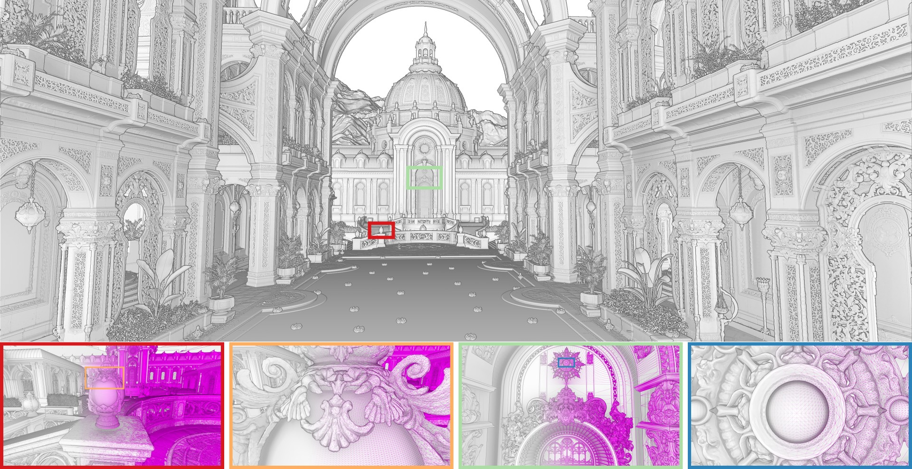
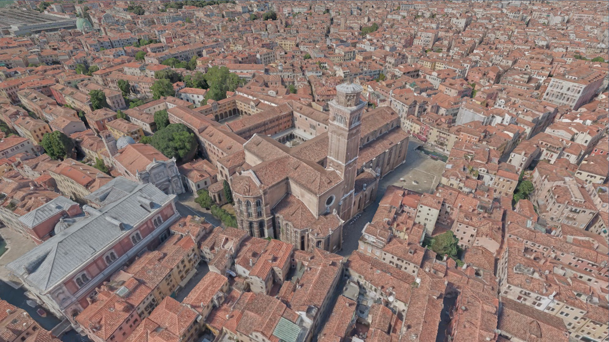
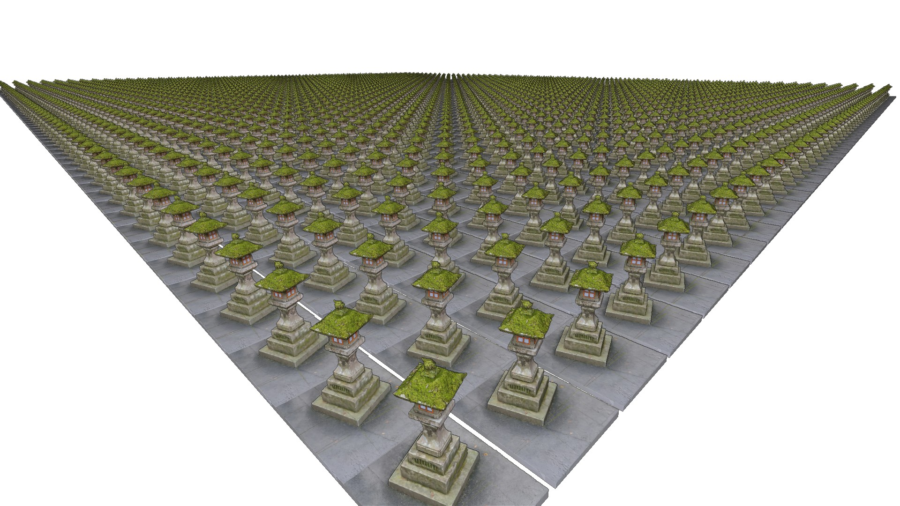

# CuRast: Cuda-Based Software Rasterization for Billions of Triangles

<a href="https://diglib.eg.org/items/e0145eb3-5971-450b-b8ca-7eaf23332df7" target="_blank" rel="noopener noreferrer">[Paper]</a>

> __Note__: This version of the code base renders point clouds (LAS files and Potree 2.0 octrees, memory-mapped and rendered directly with CUDA), and clustered LOD meshes created with [tools/clodbuilder](tools/clodbuilder/README.md). The triangle rasterization pipeline described in the paper, the Vulkan comparison renderer and the glTF/GLB loaders have been removed. 

__About__: [Nanite](https://advances.realtimerendering.com/s2021/Karis_Nanite_SIGGRAPH_Advances_2021_final.pdf) has demonstrated that small triangles can be rasterized more efficiently with custom compute shaders than with the fixed-function hardware pipeline. Building on this insight, we explore how far this advantage can be pushed for real-time rendering of massive triangle datasets without relying on precomputed LODs or acceleration structures. 

__Method__: A 3-stage rasterization pipeline first rasterizes small triangles efficiently in stage 1, and falls back to other stages for increasingly larger triangles. Stage 1 assumes triangles are small and uses 1 thread to render them directly. If they are not, they are instead queued for stage 2 which uses 1 warp to render larger triangles with more compute power. If they are still too large, they are split up and queued for stage 3. 

__Results__: With CUDA, we can render large models with hundreds of millions of unique triangles 2-5x faster than Vulkan, or up to 12x faster when it comes to instanced triangles. For smaller models producing large triangles, or models with numerous meshes with few triangles, Vulkan remains 10x faster.

__Limitations__: We currently focus on dense, opaque meshes like those you would typically obtain from photogrammetry/3D reconstruction. Blending/Transparency is not yet supported, and scenes with thousands of low-poly meshes are not implemented efficiently. 

__Future Work__: To make it suitable for games, we intend to (1) optimize handling of scenes with tens of thousands of nodes/meshes, (2) add support for hierarchical clustered LODs such as those produced by [Meshoptimizer](https://github.com/zeux/meshoptimizer), (3) add support for transparency, likely in its own stage so as to keep opaque rasterization untouched and fast. 

<table>
<tr>
	<td>
		
	</td>
	<td>
		
	</td>
	<td>
		
	</td>
</tr>
<tr>
	<td>
		<a href="https://github.com/nvpro-samples/vk_lod_clusters/blob/main/README.md#zorah-demo-scene">Zorah</a> rendered in 67.3ms into a 3840x2160 framebuffer (RTX 5090). 13.5 billion triangles in view frustum.
	</td>
	<td>
		Venice (400M triangles) rendered in 7.98ms (1920x1080p, RTX 5090).
	</td>
	<td>
		3000 instances with 1M triangles each, rendered in 9.8ms (1920x1080p, RTX 5090).
	</td>
</tr>
</table>

## Installing

CuRast runs on Linux. Dependencies: 
* CUDA 13.1 or later (expected at /usr/local/cuda). The kernels are compiled with nvcc during the build.
* A driver with HMM support (NVIDIA open kernel modules), so that CUDA kernels can read memory-mapped files directly
* On Ubuntu/Debian: `sudo apt install libx11-dev libxrandr-dev libxinerama-dev libxcursor-dev libxi-dev libwayland-dev libxkbcommon-dev wayland-protocols libvulkan-dev libtbb-dev`

```
mkdir build
cd build
cmake ../ -DCMAKE_BUILD_TYPE=Release
make -j
./CuRast
```

By default, kernels are compiled for the GPU(s) of the build machine. To build for other GPUs, pass e.g. `-DCMAKE_CUDA_ARCHITECTURES="89;120"` to cmake.

## Getting Started

Modify [initScene() in main.cpp](./src/main.cpp) to load point clouds or meshes at startup:
- `LasfileNode`: Memory-maps an uncompressed LAS file and renders its first 2 million points directly from the mapped file.
- `PotreeFileNode`: Memory-maps a point cloud converted with [PotreeConverter 2.0](https://github.com/potree/PotreeConverter) and renders the most important octree nodes, up to a point budget that can be adjusted in the toolbar (1M to 20M, default 5M). The toolbar also switches between two render paths:
    - Memory-mapped: The GPU reads the points directly from the memory-mapped octree.bin.
    - Direct Storage: Each frame, the visible nodes are read from octree.bin into VRAM via cuFile ([GPUDirect Storage](https://docs.nvidia.com/gpudirect-storage/)), without caching. True SSD-to-GPU transfers need the nvidia-fs kernel module (or PCI P2PDMA) and a supported file system such as ext4 or xfs. Otherwise, cuFile runs in compatibility mode and reads via host memory. `/usr/local/cuda/gds/tools/gdscheck -p` shows which mode is available.
- `ClusteredMeshNode`: Loads a clustered LOD mesh created with [tools/clodbuilder](tools/clodbuilder/README.md). Each frame, the clusters whose simplification error is below a threshold in pixels (toolbar: LOD Error) are selected, either by traversing a BVH over the cluster groups on the CPU (default), or by testing every cluster on the GPU. The selected clusters are then rasterized with CUDA. The toolbar switches where the clusters, vertices, triangles and the texture are read from:
    - VRAM: Copied to VRAM on first use.
    - Memory-mapped: The GPU reads them directly from the memory-mapped files.

  The texture is read from texture.dds, which `tools/clodbuilder/convert_textures.py` creates from the textures written by clodbuilder: BC7-compressed, and combined into an atlas if there are multiple textures (see [tools/clodbuilder](tools/clodbuilder/README.md)). It is decoded in the kernel, so that it can be read from VRAM or from the memory-mapped file.

### Program

| File | Role |
|------|------|
| [src/main.cpp](src/main.cpp) | Entry point and the place to define hardcoded startup scenes. |
| [src/CuRast.h](src/CuRast.h) |  |
| [src/CuRastSettings.h](src/CuRastSettings.h) | Some runtime settings.  |
| [src/scene/LasfileNode.h](src/scene/LasfileNode.h), [src/scene/PotreeFileNode.h](src/scene/PotreeFileNode.h) | Scene nodes for memory-mapped LAS files and Potree 2.0 octrees |
| [src/kernels/laspoints.cu](src/kernels/laspoints.cu), [src/kernels/potreeFileRenderer.cu](src/kernels/potreeFileRenderer.cu) | CUDA kernels that render points directly from memory-mapped files |
| [src/kernels/potreeDirectStorageRenderer.cu](src/kernels/potreeDirectStorageRenderer.cu) | CUDA kernel that renders Potree octree nodes read into VRAM via cuFile |
| [src/scene/ClusteredMeshNode.h](src/scene/ClusteredMeshNode.h) | Scene node for clustered LOD meshes created with [tools/clodbuilder](tools/clodbuilder/README.md). Loads all files into RAM, memory-maps them, and copies them to VRAM on first use. |
| [src/kernels/trianglesClustered.cu](src/kernels/trianglesClustered.cu) | CUDA kernels that select the visible clusters of the LOD cut, and rasterize them |
| [src/kernels/resolve.cu](src/kernels/resolve.cu) | Transforms the color buffer to a texture for display, including EDL |
| [src/CuRast.cpp](src/CuRast.cpp) | Host-side draw code that launches the kernels, including the octree traversal for Potree files.  |

#### Known Issues

- We don't handle "frames in flight" yet. While draw data is assembled on the CPU, the GPU may be idle and wait. In the future, while the GPU finishes drawing the current frame, the CPU should already be preparing the next frame. 

## References and Further Reads

- [Nanite](https://advances.realtimerendering.com/s2021/Karis_Nanite_SIGGRAPH_Advances_2021_final.pdf): Clustered LODs and software rasterization.
- [FreePipe](https://dl.acm.org/doi/10.1145/1730804.1730817): The first to propose using atomicMin for direct rasterization without the need to sort.
- [CUDARaster](https://dl.acm.org/doi/abs/10.1145/2018323.2018337): An efficient, hierarchical software rasterization pipeline for CUDA. 
- [cuRE](https://dl.acm.org/doi/abs/10.1145/3197517.3201374): A CUDA rendering engine (cuRE) based on a streaming pipeline that processes multiple rasterization stages simultaneously, rather than one after the other.
- [Meshoptimizer](https://github.com/zeux/meshoptimizer): Optimizes the arrangement of vertices and triangles to improve locality and/or vertex reuse, and also features hierarchical clustered LOD construction. 
- ["Billions of triangles in minutes"](https://zeux.io/2025/09/30/billions-of-triangles-in-minutes/): A blog post describing the clustered LOD construction algorithm in meshoptimizer, and the road to reducing the preprocessing time for the entire Zorah data set down to just about two and a half minutes. 
- ["Learning from failure"](https://advances.realtimerendering.com/s2015/AlexEvans_SIGGRAPH-2015-sml.pdf): A talk about the architecture and software rasterization process of the PS4 game _Dreams_. [\[video\]](https://www.youtube.com/watch?v=u9KNtnCZDMI)

### Bibtex
```
@article{CuRast,
	journal = {Computer Graphics Forum},
	title = {{CuRast: Cuda-Based Software Rasterization for Billions of Triangles}},
	author = {Schütz, Markus and Lipp, Lukas and Kristmann, Elias and Wimmer, Michael},
	year = {2026},
	publisher = {The Eurographics Association and John Wiley & Sons Ltd.},
	ISSN = {1467-8659},
	DOI = {10.1111/cgf.70538}
}
```


# reports how many pages are cached
vmtouch -v /run/media/mschuetz/Lightning/resources/pointclouds/CA13_converted/octree.bin

# evicts pages from cache
vmtouch -e /run/media/mschuetz/Lightning/resources/pointclouds/CA13_converted/octree.bin
